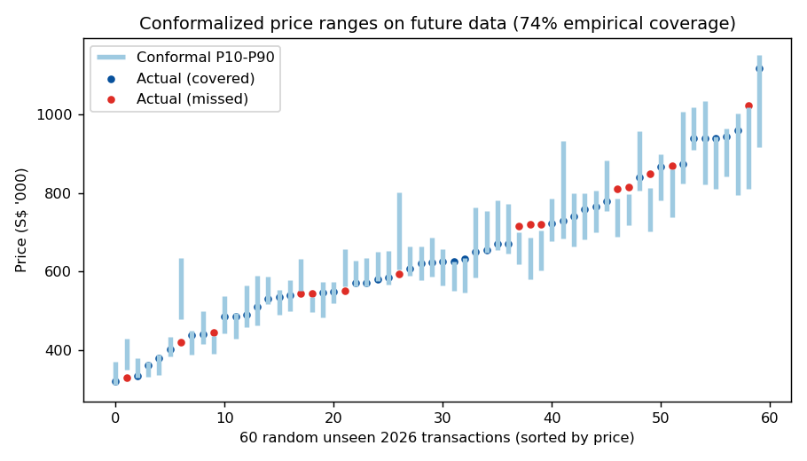
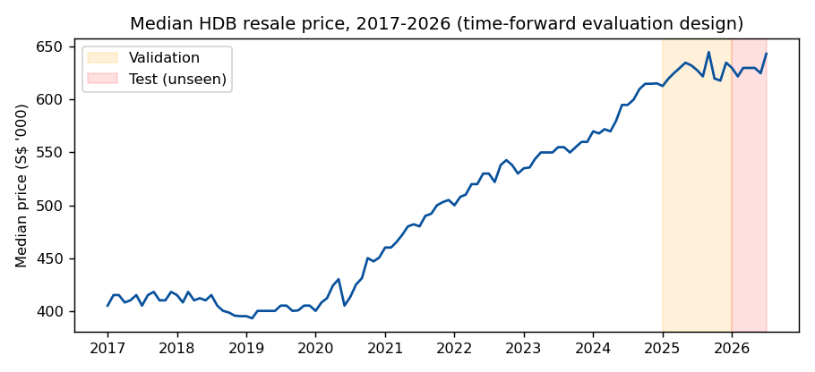
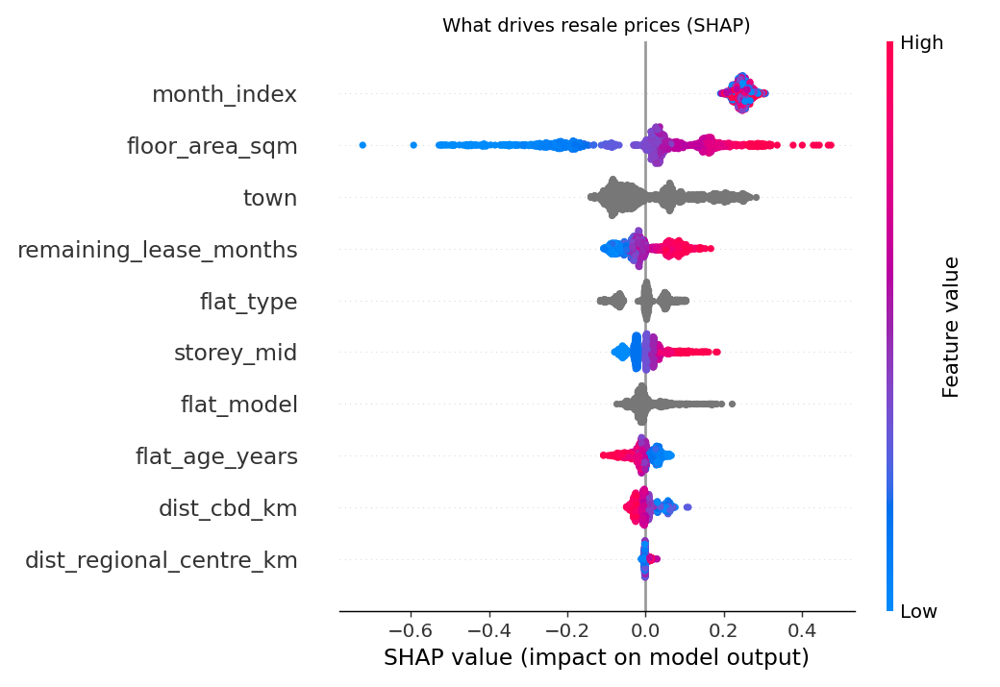
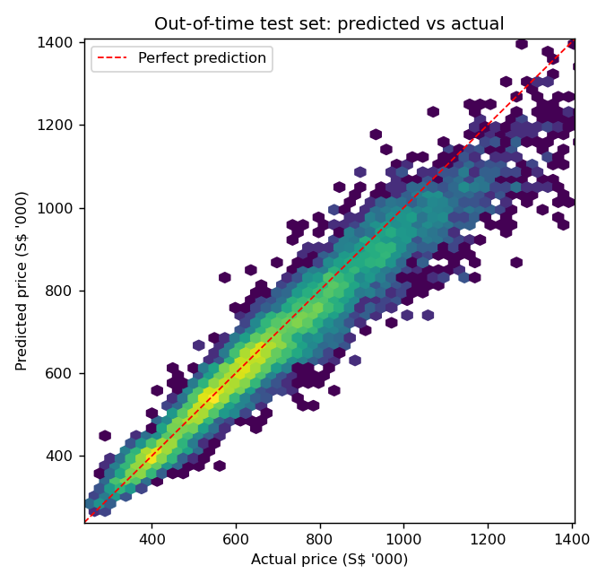
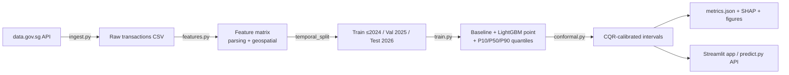

# 🏠 HDB-Lens

**Production-grade price intelligence for Singapore's HDB resale market — with calibrated uncertainty, not just point guesses.**


Most price predictors answer *"what will this flat sell for?"* with a single number that is silently wrong. HDB-Lens answers with a **statistically calibrated price range**, trained on **234,000+ real transactions** pulled live from the [data.gov.sg](https://data.gov.sg) API, and evaluated the only honest way: **on the future.** Models are trained on 2017–2024, tuned on 2025, and tested on 2026 transactions they have never seen.

| | Naive baseline¹ | **HDB-Lens (LightGBM)** |
|---|---|---|
| MAE (2026 test, n=12,605) | S$173,880 | **S$39,680** |
| MAPE | 24.5% | **5.7%** |
| R² | 0.02 | **0.93** |

¹ median price per (town, flat type) — every model must beat a lookup table before it deserves attention.

**Uncertainty that means something:** raw P10–P90 quantile models covered only **57%** of future prices (classic distribution shift — 2026's market moved). Applying **Conformalized Quantile Regression** calibrated on the most recent window lifted empirical coverage to **74%** at a median interval width of ~15% of price. The residual gap vs. the nominal 80% is a measurable signature of 2026 price drift — quantified, plotted, and discussed below rather than hidden.

<p align="center">
  
</p>

---

## Why this project is built the way it is

1. **Live data, not a Kaggle CSV.** `hdblens.ingest` hits data.gov.sg's initiate/poll download API, so every retrain reflects the latest monthly release. CI includes a schema-drift smoke test against the live API.
2. **Time-forward evaluation.** Random splits leak the future into training and flatter your metrics. All numbers here are out-of-time: the model prices 2026 flats knowing only 2017–2024.
   <p align="center"></p>
3. **Ranges beat points.** Buyers and policymakers act on risk, not point estimates. Three LightGBM pinball-loss models (P10/P50/P90) + CQR ([Romano et al., 2019](https://arxiv.org/abs/1905.03222)) produce intervals with a distribution-free coverage guarantee under exchangeability.
4. **Geography as features.** Haversine distances from town centroids to the CBD (Raffles Place) and the nearest URA regional centre (Tampines, Jurong Lake District, Woodlands, Punggol Digital District) encode Singapore's polycentric planning directly into the model.
5. **Explainability.** SHAP confirms the model has learned real economics: floor area, remaining lease, market epoch, storey, and centrality dominate — in that order.
   <p align="center"></p>
6. **Engineered like software.** Typed, documented `src/` package · 14 unit tests · ruff linting · GitHub Actions CI across Python 3.10–3.12 · Dockerized Streamlit app · Makefile workflow.

<p align="center">
  
</p>

## Architecture



## Quickstart

```bash
git clone https://github.com/DevansuA/hdb-lens && cd hdb-lens
make install          # pip install -e ".[app,dev]"
make train            # downloads live data, trains, calibrates, evaluates
make app              # launches the Streamlit price estimator
make test             # pytest + ruff
make docker           # containerized app on :8501
```

`make train` writes `models/metrics.json`, the serialized model bundle, and all figures — the numbers in this README are its direct output.

## Repository layout

```
src/hdblens/          the package
  ingest.py           live data.gov.sg download client
  features.py         parsing, flat age, haversine geo-features
  train.py            baseline + LightGBM point & quantile models
  conformal.py        CQR interval calibration
  evaluate.py         time-forward metrics, per-town error slicing
  predict.py          single-flat inference API
app/streamlit_app.py  interactive estimator with calibrated ranges
scripts/run_pipeline.py  one-command end-to-end reproduction
tests/                unit tests (parsers, geo, splits, baseline)
reports/figures/      generated diagnostics
```

## Honest limitations & roadmap

- **Coverage gap under drift.** 74% vs nominal 80% on 2026: tree models cannot extrapolate the `month_index` trend, so upper quantiles undershoot in a rising market. Next step: adaptive conformal inference (online q̂ updates) or a linear trend prior on log-price.
- **Town-centroid geography.** Distances use town centroids, not block-level geocoding. OneMap geocoding of the ~9,600 unique blocks (plus distance-to-nearest-MRT) is the highest-value feature upgrade.
- **No macro covariates.** Interest rates and cooling measures (e.g., 2025 loan-to-value changes) enter only implicitly through `month_index`.
- Per-town error slicing (`evaluate.error_by_group`) shows where the model is weakest — small-volume central towns — a candidate for hierarchical pooling.

## Data

[HDB Resale Flat Prices (from Jan 2017)](https://data.gov.sg/datasets/d_8b84c4ee58e3cfc0ece0d773c8ca6abc/view), Housing & Development Board, via data.gov.sg. Made available under the Singapore Open Data Licence.

---

*Built by [Devansu Agarwal](https://www.linkedin.com/in/devansua9/) — Data Science @ NUS, Data Analytics @ A\*STAR, Student Researcher @ Lee Kuan Yew School of Public Policy.*
